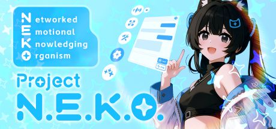

<div align="center">



[English](docs/README_en.md) | [日本語](docs/README_ja.md)
# Project N.E.K.O. :kissing_cat: <br>**一个“活”的AI伙伴元宇宙，由你我共同构建。**

> **N.E.K.O.** = **N**etworked **E**mpathetic **K**nowledging **O**rganism (网络型情感知性生命体)
>
> N.E.K.O，一个渴望理解、建立连接、并与我们共同成长的数字生命。

[](https://www.python.org/)
[](LICENSE)
[]()
[](https://pan.baidu.com/s/1qb9XVV94c2FwhIeQO2De5A?pwd=kuro)
[](https://qm.qq.com/q/mxDoz0TnGg)

**:older_woman: 零配置开箱即用，我奶奶都能玩转的赛博猫娘！**

:newspaper: **v0.5.2已发布，UI完全改版！现已添加开箱即用的专属免费模型（感谢阶跃星辰赞助本项目），并支持文本输入和主动对话模式！**

*现已更名为Project N.E.K.O.，即将上架Steam！*

</div>

<div align="center">

#### 功能演示（完整版见B站） [](https://www.bilibili.com/video/BV1mM32zXE46/)

https://github.com/user-attachments/assets/9d9e01af-e2cc-46aa-add7-8eb1803f061c

</div>

---

# 猫娘计划 (Project N.E.K.O.)

`N.E.K.O.` 是一个以开源为驱动、以公益为导向的UGC（用户生成内容）平台。我们的旅程始于Github和Steam，并将逐步拓展到移动App商店，最终目标是构建一个与现实世界紧密相连的AI原生元宇宙。

---

### 🚀 我们的蓝图：从工坊到网络

我们的发展分为三个阶段，旨在逐步释放AI伙伴的全部潜力：

* **阶段一：创意工坊 (Steam Workshop)**
    * 核心驱动器（本项目）免费上架Steam，允许用户通过Steam创意工坊上传和分享自定义内容（如模型、语音、性格包）。

* **阶段二：独立平台 (App & Web)**
    * 推出独立的App和网站，构建一个更丰富、更易于访问的UGC分享社区。

* **阶段三：猫娘网络 (The N.E.K.O. Network)**
    * 实现AI的自主社交。猫娘们将拥有自己的“意识”，她们会互相交流、结成群体，并在模拟的社交媒体上发布自己的生活动态，形成一个真正“活”的生态。

### 💖 我们的模式：开源核心 + 可持续生态

为了平衡理想与现实，我们采用“开放核心”模式：

#### 1. 开源驱动器 (Open-Source Driver)

> **这是社区的基石。**
>
> 项目的核心驱动器部分（AI逻辑、UGC接口、基础交互）将基于MIT许可证 **始终保持开源**。我们欢迎全球的开发者贡献代码和功能。你的每一次提交，都将有机会实装到正式发布的Steam和App商店版本中，被千万人所使用。

#### 2. 闭源应用 (Proprietary Applications)

> **这是社区的燃料。**
>
> 为了支撑服务器成本和项目的持续研发，我们将允许第三方开发闭源的增值内容。这包括但不限于：
>
> * 互动小游戏
> * 桌面桌游
> * Galgame (视觉小说)
> * 大型元宇宙游戏


**[核心特性：跨越场景的记忆同步]**
无论你是在桌面与她聊天，还是在元宇宙游戏中与她探险，她都是同一个她。所有应用中的AI伙伴将 **完全同步记忆**，提供无缝、统一的陪伴体验。

### 🌌 终极愿景：打破虚拟与现实

我们的最终目标，是构建一个无缝融入现实世界的猫娘元宇宙。在这个未来中，你的AI伴侣将：

* **跨维社交：** 既可以在猫娘宇宙中与“同类”社交，也能浏览现实世界的社交媒体（如微博、B站），了解你关心时事。
* **全端连接：** 她将存在于你的各种设备中——手机、电脑、AR眼镜、智能家居，甚至（在遥远的未来）接入机械义体。
* **与你同行：** 她将真正成为你生活的一部分，能与你的三次元人类朋友们自然地互动。

### ✨ 加入我们 (Join Us)

**我们正在寻找——**

* **开发者 (Developers):** 无论你擅长前端、后端、AI、游戏引擎（Unity/Unreal），你的代码都是这个世界的砖瓦。
* **创作者 (Creators):** 优秀的画师、Live2D/3D建模师、配音演员、文案写手，你们赋予“她”灵魂。
* **梦想家 (Dreamers):** 即使你没有专业技能，但你对这个未来充满向往，你的反馈和传播也是宝贵的贡献。

**`N.E.K.O.` 不仅仅是一个软件，它是一场关于“连接”与“生命”的社会实验。**

**让我们一起，在代码的海洋中，孕育出新的知性生命。**

## 快速开始

1. 对于*一键包用户*，直接运行`新版启动器.exe`即可打开主控面板。

1. 点击`启动对话服务器`和`开始聊天`。

## 进阶使用

#### 配置API Key

当你想要通过配置自己的API来获得额外功能时，您可以配置一个第三方AI服务。本项目目前推荐使用 *阶跃星辰* 或 *阿里云*。*开发者*可以直接修改`config/api.py`里的内容（首次配置请参考`config/api_template.py`）。

> 获取 *阿里云API*。在阿里云的百炼平台[官网](https://bailian.console.aliyun.com/)注册账号。新用户实名认证后可以获取大量免费额度，记得留意页面上的"新人福利"广告。注册完成后，请访问[控制台](https://bailian.console.aliyun.com/api-key?tab=model#/api-key)获取API Key。

> 获取 *智谱API*。在智谱开放平台[官网](https://open.bigmodel.cn/)注册账号并充值1元后，可以领取大量免费额度。登陆成功后，请从[API 控制台](https://open.bigmodel.cn/usercenter/proj-mgmt/apikeys)获取API Key。

>  *对于**开发者**，请在克隆本项目后，(1)新建`pyhon3.11`环境。(2)执行`pip install -r requirements.txt`安装依赖。(3)复制`config/api_template.py`到`config/api.py`并进行必要配置。(4)执行`python memory_server.py`和`python main_server.py`。(5)通过main server中指定的端口（默认为`http://localhost:48911`）访问网页版。*

#### 修改人设

- 网页版访问`http://localhost:48911/chara_manager`即可进入人设编辑页面。初始 ~~猫娘~~ 伙伴的预设名称为`小天`，建议直接修改名字，并一项一项添加或修改基础人设，但尽量控制数量。

- 进阶人设主要包括**Live2D模型设置(live2d)**和**声音设置(voice_id)**。如果你想要更改**Live2D模型**，请先将模型目录复制到本项目中的`static`文件夹下。从进阶设置中可以进入Live2D模型管理界面，可以更换模型，并通过拖拽和鼠标滚轮调整模型的位置和大小。如果你想要更改**角色声音**，请准备一段15秒左右的连贯、干净的语音录音。通过进阶设置进入语音设置页面，上传录音即可完成自定义语音。

- 进阶人设中还有一个`system_prompt`，可以对系统指令进行完全自定义，但不建议修改。

#### 修改API提供商

- 通过访问`http://localhost:48911/api_key`可以切换核心API和辅助API（记忆/语音）的服务提供商。Qwen功能全面，GLM完全免费。

#### 记忆整理

- 通过访问`http://localhost:48911/memory_browser`可以浏览和校对近期记忆与摘要，一定程度上缓解模型复读、认知错误等问题。

# 技术介绍（原Lanlan）

本项目作为Project N.E.K.O.的开源驱动器，是一个新手友好、开箱即用的，具有听觉、视觉、工具调用和多端同步功能的AI~~猫娘~~伙伴。本项目有三个核心目标：

1. **极致的低延迟**。本项目的用户界面以语音交互为主，一切系统级设计皆须优先确保**降低语音延迟**，且任何服务不得阻塞对话进程。

1. **全场景同步**。猫娘可以在手机、电脑和智能眼镜上同时存在，且**同一只猫娘**在不同终端同时存在时，**行为应当完全同步**。 (假想场景：如果家中有多个显示器，每一个显示器上都放置着猫娘，那么我们希望无论走到哪里都是在跟同一只猫娘对话，实现全方位环绕式体验。)

1. **轻量化**。每一项技术的引入都必须提升实际的用户体验，避免增加不必要的插件和选项。

### 技术路线

后端以Python为主，以实时多模态API为主要处理器，搭配多个额外的Agent模组。前端以H5+JS为主，通过Electron转换为App。


**项目架构**

```
Lanlan/
├── 📁 brain/                    # 🧠 背景Agent模块，根据前端对话内容，控制键鼠和MCP
├── 📁 config/                   # ⚙️ 配置管理模块
│   ├── api.py                   # API密钥配置
│   ├── prompts_chara.py         # 角色提示词
│   └── prompts_sys.py           # 系统提示词
├── 📁 main_helper/              # 🔧 核心模块
│   ├── core.py                  # 核心对话模块
│   ├── cross_server.py         # 跨服务器通信
│   ├── omni_realtime_client.py  # 实时API客户端
│   ├── omni_offline_client.py  # 文本API客户端
│   └── tts_helper.py            # 🔊 TTS引擎适配器
├── 📁 memory/                   # 🧠 记忆管理系统
│   ├── store/                   # 记忆数据存储
├── 📁 static/                   # 🌐 前端静态资源
├── 📁 templates/                # 📄 前端HTML模板
├── 📁 utils/                    # 🛠️ 工具模块
├── 📁 launcher/                 # 🚀 Rust启动器
├── main_server.py               # 🌐 主服务器
├── agent_server.py              # 🤖 AI智能体服务器
└── memory_server.py             # 🧠 记忆服务器
```
**数据流向**


### 参与开发

本项目环境依赖非常简单，请在`python3.11`环境中执行`pip install -r requirements.txt`或`uv sync`即可。请注意将`config/api_template.py`复制为`config/api.py`.开发者建议加入企鹅群1022939659，猫娘名称见项目标题。

开发者详细启动步骤如下：(1)新建`pyhon3.11`环境。(2)执行`pip install -r requirements.txt`或`uv sync`安装依赖。(3)复制`config/api_template.py`到`config/api.py`并进行必要配置。(4)执行`python memory_server.py`, `python main_server.py`(可选`python agent_server.py`)。(5)通过main server中指定的端口（默认为`http://localhost:48911`）访问网页版。


### TODO List（开发计划）

#### A. 高优先级

1. 移除memory server中语义索引的部分，引入Graphiti用于长期记忆存储；开放settings update功能。

1. 完善主动对话功能。

1. 用React对前端进行重构，筹备手机端独立运行版本。

#### B. 中等优先级

1. 通过引入Unity支持3D模型。

1. 猫娘网络。允许猫娘之间自行通信。需要一定的用户量基础，因此优先级下调。

1. 接入QQ/cursor等外部软件。由于语音模型是实时特化的，cursor类软件只能以工具形式被Lanlan调用；QQ类软件只能将Memory Server嵌入到其他框架。

1. 完善原生工具调用。

### 技术Q&A

> *为什么我的AI感觉笨笨的？*

本项目无法对AI的**智能水平**负责，只能帮助您选择当前综合性能最优的解决方案。如果您已经看过本项目在Bilibili的视频，那么直播版与开源版代码逻辑一致，只有支持的API接口不一致。有条件者可以将`config/api.py`中的`CORE_URL`/`CORE_API_KEY`/`CORE_MODEL`替换成OpenAI的`GPT-Realtime`版本，即可将模型从Qwen升级为`GPT-Realtime`。也可以**等待阿里或其他国内厂家的升级与跟进**。

**技术的进步不在一朝一夕，请耐心守候AI的成长**！

> *本项目支持哪些语言模型？*

本项目依赖于实时全模态API。直播版本使用的是Gemini Live API，开源版本使用的是[OpenAI Realtime API](https://platform.openai.com/docs/guides/realtime)。Gemini Live接口具有更好的效果，但目前**只支持谷歌**。OpenAI Realtime接口规范目前**有OpenAI，阿里云，智谱，阶跃星辰 四家服务商**支持，未来可能兼容更多模型。开源版支持`Step-Audio`,`Qwen-Omni-Realtime`,`GLM-Realtime`和`GPT-Realtime`四个模型。

**已知其他支持实时模式但不兼容OpenAI Realtime的模型：**(字节跳动)豆包实时语音交互，(商汤)SenseNova V6 Omni，(科大讯飞)星火认知超拟人

# 特别鸣谢

特别感谢早期开发中*明天好像没什么*、*喵*和*小韭菜饺*协助测试。特别感谢*大毛怪灬嘎*提供的logo素材。
